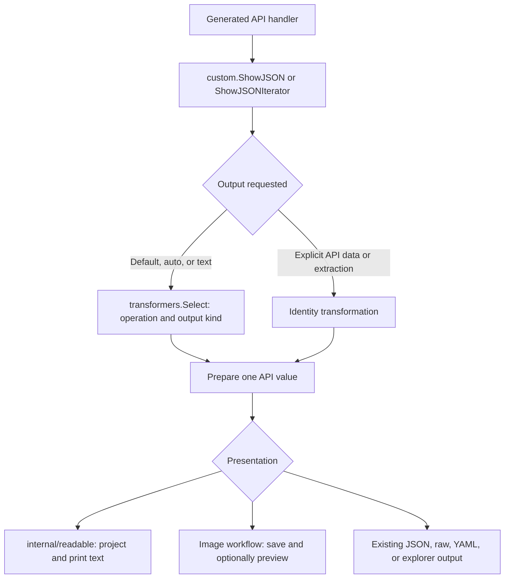

# Output transformation and presentation

Feature work extends the command and output hooks introduced by
[PR #223](https://github.com/openai/openai-cli/pull/223), at upstream commit
`8de34a7e953e3694b472e64445ccaf6c16edd8d7`. The generated handlers still make the
API calls and pass responses to `ShowJSON`, `ShowJSONIterator`, or the binary
output hook. No generated handler is hand-edited to install these features.

## Responsibilities

```text
cmd/openai/main.go       Run the CLI, completion, errors, and exit codes
        │
pkg/cmd                 Generated commands and custom_runtime.go bridge
        │
pkg/custom              Register features and coordinate requests and output
        ├── pkg/transformers      Select and normalize one API value
        └── internal libraries   Help, readable output, saved files, terminals
```

`custom.ConfigureCommand` receives the assembled tree and decorates it. It can
set defaults, wrap an action, or register a local command without importing
`pkg/cmd`. Implementation libraries likewise do not import the command tree or
the custom runtime. See the [feature review map](../image-implementation.md)
for each feature's integration file and implementation library.

`main.go` retains the executable lifecycle rather than forwarding the whole
program to another package. Its feature changes have specific purposes:

| Change | Why it belongs at startup or the error boundary |
| --- | --- |
| Configure local help and run request validation during execution | Help remains available when API configuration is missing or invalid. Actual requests still validate their configuration. |
| Read wrapped `cli.ExitCoder` errors with `errors.As` | Command wrappers can add context without losing the original exit code. |
| Ask custom error presenters for readable guidance | Feature-specific advice uses command flags and metadata; the entrypoint still chooses the exit status. |
| Send explicit API error output to stderr without an HTTP prefix | `--format-error json` produces parseable JSON without mixing successful output and errors. |

The upstream `pkg/cmd/runtime_compat.go` is a handwritten compatibility file
preserving older public aliases. It remains alongside the generated bridge;
this feature does not change its ownership or remove those aliases.

## Follow one response



`transformers.Route` identifies the operation and whether a value is a response,
page item, or stream event. `transformers.Select` is the registry inherited from
PR #223. A selected transformer receives one value and returns one value. It
does not consume a stream, write a file, print text, or perform network access.

Readable presentation is a separate concern in `internal/readable`. Its
`Project` function selects full text or a resource summary and returns a `View`.
That view stays separate from the API value: no presentation marker or summary
replaces the original JSON. `WriteResult` and `StreamWriter` render the view,
escape terminal controls, retain useful details, and avoid repeating completion
snapshots after text deltas.

The custom runtime prepares each consumed item once. It owns iteration,
cancellation, limits, and propagation of errors from the source or writer.
Repeated inspection of the current item does not rerun its transformation.
Failure classification inspects original stream events before transformation or
field extraction, so selecting a field cannot conceal a failed request's exit
status. The renderer owns only presentation state, not the source iterator.

Explicit `json`, `jsonl`, `raw`, `yaml`, `pretty`, and `explore` formats bypass
default transformations and readable projections. `--transform` remains GJSON
field selection, and `--raw-output` keeps its extraction behavior. `auto` and
`text` choose normal presentation. See the [readable output guide](../readable-output.md)
for the required `--format json` migration in scripts.

## Images, audio, and errors

The image action wrapper prepares request options once and calls the generated
action. `FlagOptions` consumes those prepared options without rereading stdin
or reopening upload files. The image transformer normalizes known partial and
completed stream events into the same `data` shape used by ordinary responses,
while retaining event metadata. Explicit API-data output preserves original
responses and events.

The custom image workflow coordinates saving and progress. `internal/imageoutput`
owns file naming, decoding, collision handling, and cleanup.
`internal/terminalimage` owns terminal detection and preview rendering, including
Apple Terminal's font preparation through the font, macOS, and gallery libraries.
A failed optional preview does not discard a successfully saved image.

Native audio text and speech SSE use adapters at the existing transport/output
hooks. Binary downloads retain their byte or file contract. API errors do not
have a successful-operation route: custom error presenters supply guidance,
while the entrypoint retains error output and exit handling. Commands with no
response body can print a readable success confirmation without inventing an API
response.

## Checks

`tests/architecture/output_pipeline_test.go` checks production imports,
including platform-specific files. Custom runtime and transformers cannot
import generated commands or the executable. New response transformations stay
independent of I/O and presentation libraries. The terminal renderer inherited
from PR #227 (`images.go`, `image_errors.go`, and its registry in `output.go`)
keeps its existing, explicitly listed imports. The check does not permit new
I/O dependencies in those files or other transformations. Feature libraries
cannot reach back into the command tree or custom runtime. These checks need neither
Git history nor generated snapshots; they do not replace custom-code accounting.

Behavior tests cover selection, explicit data bypass, lazy iteration,
cancellation, stream failures, command-hook composition, help, saving, and
cleanup. Entrypoint tests call the actual `main()` in a fresh process.

```sh
go test ./tests/architecture ./pkg/transformers ./internal/readable ./internal/clihelp
go test ./pkg/custom ./cmd/openai
```

Native terminal appearance remains a separate verification task. Compilation,
mocked automation, and synthetic API tests cannot establish that every terminal,
font, or profile renders correctly.

## Combined branch and the inherited image renderer

This branch starts from PR #227 at `b1fe75c` and incorporates the complete
PR #226 experience. The generated handlers and #227's `SelectTerminal` hook
remain in place. Configured image commands prepare one request and own their
save/preview policy at `ShowJSON` or `ShowJSONIterator`. That branch returns
before the inherited terminal renderer can run, preventing duplicate downloads,
previews, or font activation. A configured workflow with no save plan still
owns its explicit URL or API-data output; it does not enter the fallback.

Callers that invoke the output boundary without configuring an image workflow
retain #227's implicit-auto terminal renderer. It requires an actual terminal
file, honors cancellation, and leaves explicit formats untouched. Its download
and decode failures preserve the original response for ordinary presentation.

The combined branch keeps #226's intentional default: readable output, including
pipes, and automatic image saving. Use `--format json` for API data without
saving. This differs from #227's default JSON output for pipes and is covered
by the saving and explicit-data integration tests.
