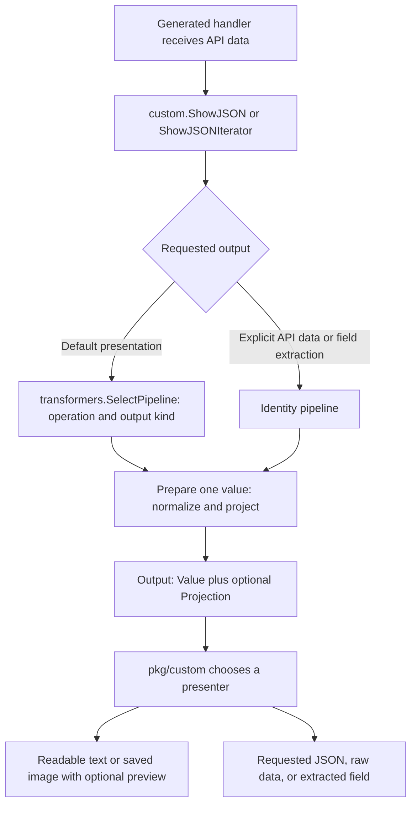

# Output transformation and presentation

The CLI customizes generated commands at their existing output boundary. A
generated handler passes a response to `ShowJSON`, or an iterator to
`ShowJSONIterator`. The custom runtime prepares that data before choosing how
to display or save it. It does not capture and reparse printed terminal output.

## The package split already exists

[PR #223](https://github.com/openai/openai-cli/pull/223), represented here by
upstream commit `8de34a7e953e3694b472e64445ccaf6c16edd8d7`, introduced the
generated runtime bridge and response-routing metadata. Feature work uses that
contract; it does not need another Castiron change to establish the same split.

```text
cmd/openai/main.go                  Launch custom.Run(cmd.Command, os.Args)
        │
        ▼
pkg/cmd                            Generated command tree and API handlers
        │                          Generated custom_runtime.go bridge
        ▼
pkg/custom                         Request defaults, lifecycle, output selection
        │                          Printing, saving, previews, and errors
        ▼
pkg/transformers                    Pure response normalization and projections

internal                           Focused implementation helpers used by custom
tests/cli                          Tests through the executable's runtime
tests/architecture                 Checks package and bootstrap boundaries
```

Dependencies flow from generated commands to custom runtime to transformers.
Neither handwritten layer imports the generated command package or the
executable. Transformers also stay independent of `internal` helpers, which
may manage files, terminals, fonts, or network-related work.

Go compiles the applicable files in `pkg/cmd` together as one package.
`main.go` imports that package, rather than importing individual generated
files such as `image.go`. The generated tree installs `custom.ConfigureCommand`
after assembly. Command decoration can adjust defaults or add local commands
before execution without changing generated handlers.

After startup, the command pipeline has no dependency on `main.go`.
`custom.Run` owns the outer lifecycle, including help, completion, error
presentation, and exit codes. The executable only passes in the generated tree
and arguments, then exits with the returned status.

### An inherited compatibility exception

The upstream `pkg/cmd` directory also contains a small handwritten
`runtime_compat.go` and handwritten integration tests. The compatibility file
preserves public type aliases and constants from before the runtime migration.
This feature does not add new handwritten implementation there.

Making that directory literally entirely generated is a separate cleanup. A
Castiron-generated bridge must first preserve those public aliases; deleting
them would break callers. Handwritten integration tests can move independently.
Do not rename handwritten files as generated or change snapshot ownership to
make a boundary or budget check pass.

## One output selection point



`Route` identifies the generated operation and whether its output is a complete
response, page item, or stream event. `SelectPipeline` is the central registry
for default behavior. The older `Select` entry point remains available for
compatibility and obtains its transformation from that registry.

Each pipeline prepares one value and returns a typed `Output`:

- `Value` contains the value after any selected normalization.
- `Projection` holds optional readable text or selected summary fields, plus
  metadata such as stream-part identity and whether summary fields were omitted.

A projection does not overwrite the value. The custom presenter decides
whether to use it, how to escape terminal control characters, and whether to
show a hint such as `Use --format json for all fields.` Transformers do not
print, open files, make API calls, select terminal protocols, or advance an
iterator. They check cancellation before publishing prepared output.

Explicit `--format json`, `--format raw`, and field extraction operate on the
original API data through the identity path. This choice happens before default
transformations. Explicit `--format auto` and `--format text` select default
presentation, just like omitting the option. Setting raw-string formatting early
as an image-rendering shortcut would bypass the transformation hook, so
presentation is selected after preparing the result instead.

For iterators, custom runtime owns reading, limits, cancellation, stream failure
status, and cleanup. It prepares each consumed item once; inspecting the current
item does not rerun a transformation. A stream's partial images and final image
use the same selected normalizer and actual operation route while retaining their
distinct event types. Optional image previews can recover from normalization
errors while a final image remains authoritative. The image presenter calls the
shared preparation helper only when consuming an image it will render or save.
Failure classification runs on original stream events before transformations,
including in explicit data modes, so projection or extraction cannot hide a
failed request's exit status.

## Images use the same boundary

The image command wrapper prepares its request once and delegates the API call
to the generated handler. The existing request-options hook supplies the
prepared options, preventing a second read of stdin or uploaded files.

Ordinary image responses already contain a `data` array. Known image stream
events can be normalized into that shape while preserving event metadata.
The custom image presenter and `internal/imageoutput` own naming, decoding,
file writes, progress-preview lifetime, and optional terminal display.

This is CLI presentation work. Changing Go SDK response types would affect
other SDK users and would not fix a generated handler that captures the raw HTTP
body. No SDK return-type change is required for this feature.

API errors have no successful-operation route. Their readable guidance and
explicit data formatting belong to the custom runtime. Commands that return
no response body can confirm success there without inventing an API payload.
Binary downloads also retain their byte/file contract; they are not silently
converted into JSON responses.

## Guardrails and checks

`tests/architecture/output_pipeline_test.go` checks production imports across
platform-specific files, excludes tests and test fixtures, and requires the
executable to remain a single bootstrap file. New transformer dependencies
need review; terminal, filesystem, network, process, and CLI implementation
dependencies belong outside that package. These checks work in an ordinary
clone without Git history or generated snapshots. They are structural
guardrails, not a proof that every function is pure.

Runtime tests additionally verify transformer selection, explicit API-data
bypass, lazy iteration, cancellation, error propagation, command-hook
composition, and generated API help preservation. The custom-code budget still
uses its existing generated-snapshot accounting; the architecture tests do not
replace or alter that check.

```sh
go test ./tests/architecture ./pkg/transformers
go test ./pkg/custom -run 'Test(ShowJSON|OutputIterator|ConfigureCommand|ImageWorkflow|ImagePresentation)'
go test ./tests/cli
```

See [the image implementation map](../image-implementation.md) for individual
files and [the readable output guide](../readable-output.md) for user behavior.

## Proposed review slices

These are review slices and planned follow-ups, not a claim that branches or
pull requests have been created. Keep the working baseline available while
preparing small diffs against the appropriate reviewed base. This working branch
already contains the feature implementations; its complete history should not be
used as the first architecture-only PR. Extract that contract and its tests
against the upstream bridge first, then introduce feature registrations in the
following slices.

1. **Architecture only:** unify selection and typed output preparation, add
   boundary tests, and update architecture documentation. Preserve observable
   behavior; use the generated bridge that already exists.
2. **Image generation:** review default model/settings, automatic saving,
   filenames, concise help, and explicit JSON compatibility together.
3. **Editing and streaming:** add source uploads, variations, partial events,
   final-image saving, cancellation, and owned-file cleanup.
4. **Readable output across the CLI:** review resource summaries, text results,
   errors, success confirmations, and the script migration to explicit formats.
5. **Experimental Apple Terminal rendering:** review font copying, tab selection,
   caching, restoration, and visual compatibility separately from ordinary image
   saving and terminal image protocols.

The final slice needs native visual testing. A successful compilation or
synthetic API test does not establish that every terminal, font, or profile
renders images correctly.
