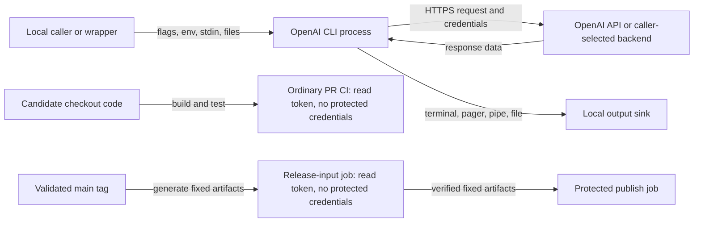

# OpenAI CLI security model

This document is the single canonical detailed threat model for this
repository. It is reusable across changes and is the authority for
trust-boundary decisions during Codex Security scans. [SECURITY.md](../../SECURITY.md)
remains the authority for private vulnerability reporting and coordinated
disclosure.

## 1. Overview

`openai-cli` is a local Go command-line client for the OpenAI REST API. It is
not a daemon and does not expose an inbound network listener. A user invokes
resource commands, the CLI parses flags or piped YAML/JSON, may read local
files, constructs requests through `openai-go`, and renders API responses to a
terminal, pager, pipe, or file. The entry point runs the generated command
tree, validates an environment-selected base URL, and formats API errors
([cmd/openai/main.go:17-61](../../cmd/openai/main.go#L17-L61),
[pkg/cmd/cmd.go:26-45](../../pkg/cmd/cmd.go#L26-L45)).

Most endpoint commands under `pkg/cmd/` are generated from the checked-in
OpenAPI snapshot; shared request plumbing and selected files such as
`flagoptions.go` and `mtls.go` are handwritten. That split matters for
maintenance, but both generated and handwritten tracked source are repository
code once reviewed and executed
([CONTRIBUTING.md:34-47](../../CONTRIBUTING.md#L34-L47),
[pkg/cmd/cmd.go:1](../../pkg/cmd/cmd.go#L1)).

| Component | Responsibility | Evidence |
| --- | --- | --- |
| `cmd/openai` and generated `pkg/cmd` commands | Parse CLI arguments, construct SDK clients, and invoke API resources, including ordinary and organization-administration operations. | [cmd/openai/main.go:17-31](../../cmd/openai/main.go#L17-L31), [pkg/cmd/cmd.go:82-101](../../pkg/cmd/cmd.go#L82-L101), [pkg/cmd/cmd.go:103-150](../../pkg/cmd/cmd.go#L103-L150) |
| `internal/requestflag` and `pkg/cmd/flagoptions.go` | Map flags and piped YAML/JSON into path, query, header, and body values; expand file references; serialize requests. | [internal/requestflag/requestflag.go:61-80](../../internal/requestflag/requestflag.go#L61-L80), [pkg/cmd/flagoptions.go:320-560](../../pkg/cmd/flagoptions.go#L320-L560) |
| `pkg/cmd/mtls.go` | Read a caller-selected client certificate/key pair and construct the custom mTLS transport. | [pkg/cmd/mtls.go:29-45](../../pkg/cmd/mtls.go#L29-L45), [pkg/cmd/mtls.go:78-152](../../pkg/cmd/mtls.go#L78-L152) |
| `internal/debugmiddleware` and output code | Log redacted HTTP metadata when requested and display or write API responses. | [internal/debugmiddleware/debug_middleware.go:43-63](../../internal/debugmiddleware/debug_middleware.go#L43-L63), [pkg/cmd/response.go:429-481](../../pkg/cmd/response.go#L429-L481) |
| Development and release tooling | Run local tests/mock tooling and build, validate, sign, attest, and publish official release artifacts. | [scripts/test:28-61](../../scripts/test#L28-L61), [docs/releasing.md:3-29](../releasing.md#L3-L29) |

| Deployment or workflow | Resource or capability | Configuration and precedence | Safe effective value or location | Readers, writers, or recipients | Enforcing control | Evidence or unknowns |
| --- | --- | --- | --- | --- | --- | --- |
| Normal CLI invocation | API/admin credentials and tenant selectors | Global flags may source `OPENAI_API_KEY`, `OPENAI_ADMIN_KEY`, `OPENAI_ORG_ID`, `OPENAI_PROJECT_ID`, and `OPENAI_WEBHOOK_SECRET`. | Process memory and outbound SDK request options; never repository files. | Invoking process and selected API backend. | Caller chooses credentials; server remains authoritative for authentication, authorization, and tenancy. | [pkg/cmd/cmd.go:82-101](../../pkg/cmd/cmd.go#L82-L101), [pkg/cmd/cmdutil.go:42-74](../../pkg/cmd/cmdutil.go#L42-L74) |
| Normal CLI invocation | Request destination | `--base-url` overrides the default; `OPENAI_BASE_URL` is validated at startup. | Default SDK endpoint or explicit `http://`/`https://` caller-selected URL. | Selected network origin and any configured proxy. | CLI validates URL shape; `openai-go` owns normal transport, redirects, and auth-header behavior. | [pkg/cmd/cmd.go:39-45](../../pkg/cmd/cmd.go#L39-L45), [cmd/openai/main.go:24-28](../../cmd/openai/main.go#L24-L28), [pkg/cmd/cmdutil.go:33-39](../../pkg/cmd/cmdutil.go#L33-L39); default SDK behavior is an external dependency. |
| mTLS invocation | Client certificate and private key | Dedicated flags or `OPENAI_MTLS_CLIENT_CERT_FILE` / `OPENAI_MTLS_CLIENT_KEY_FILE`; both are required together. | Caller-selected PEM files read locally; key bytes are cleared after use. | CLI process and same-origin HTTPS endpoint only. | Explicit HTTPS base URL, matching pair, HTTPS-proxy rejection, and same-origin redirect limit. | [pkg/cmd/mtls.go:17-45](../../pkg/cmd/mtls.go#L17-L45), [pkg/cmd/mtls.go:78-152](../../pkg/cmd/mtls.go#L78-L152) |
| Piped request input | YAML/JSON and referenced local files | Explicit flags take precedence; unset request fields can be populated from stdin. `OPENAI_UNTRUSTED_STDIN` preserves provenance. | Parsed in process; trusted `@` references may read files, while untrusted-stdin values remain literal. | CLI process, local files explicitly referenced under trusted mode, selected API backend. | Single-consumer stdin, provenance-marked literal values, and rejection of stdin-derived binary file paths in untrusted mode. | [pkg/cmd/flagoptions.go:356-447](../../pkg/cmd/flagoptions.go#L356-L447), [pkg/cmd/stdinsecurity.go:12-89](../../pkg/cmd/stdinsecurity.go#L12-L89), [pkg/cmd/flagoptions.go:608-641](../../pkg/cmd/flagoptions.go#L608-L641) |
| Integration tests | Local mock executable and OpenAPI snapshot | Checked-in spec is hash-checked by default; an explicit local path or URL is caller-selected and its content is untrusted. | Pinned fork source and checksum-verified Deno runtime; mock binds `127.0.0.1:4010`. | Local test process and any caller-selected specification origin or referenced resource. | Full Git commit, pristine source checks, HTTPS-only runtime download and redirects, runtime SHA-256 verification, and frozen Deno dependencies authenticate tooling; they do not authenticate caller-selected specification content. | [scripts/mock](../../scripts/mock), [scripts/steady/install](../../scripts/steady/install), [scripts/steady/settings](../../scripts/steady/settings) |
| Ordinary test/build pull-request CI | Candidate checkout execution | `.github/workflows/ci.yml` checks out the candidate revision and runs tracked scripts/tests. | GitHub runner with `contents: read`; no persisted checkout credentials or protected write/signing credentials. | CI runner and configured test dependencies. | Minimal job permissions and no persisted checkout credentials; tracked executable files run as repository code. | [.github/workflows/ci.yml:1-27](../../.github/workflows/ci.yml#L1-L27), [.github/workflows/ci.yml:110-127](../../.github/workflows/ci.yml#L110-L127) |
| CodeQL pull-request analysis | Candidate checkout and analysis result upload | `.github/workflows/codeql.yml` checks out the candidate revision; the Go matrix uses autobuild. | GitHub runner with `actions: read`, `contents: read`, and scoped `security-events: write`; no persisted checkout credentials or release/signing credentials. | CodeQL analysis service and GitHub security-events sink. | Scoped job permissions, pinned actions, and no persisted checkout credentials; the write capability is a real CI boundary. | [.github/workflows/codeql.yml:7-24](../../.github/workflows/codeql.yml#L7-L24), [.github/workflows/codeql.yml:27-47](../../.github/workflows/codeql.yml#L27-L47) |
| Release | Official artifacts and publishing credentials | A job without protected write/signing credentials generates fixed release inputs from a validated tag; a protected publisher verifies them before obtaining publishing credentials. | Fixed artifact paths, protected `publish` environment, scoped app tokens, signing/notarization secrets. | Release jobs, GitHub releases, Homebrew, artifact attestation. | Tag-on-main and SHA binding, fixed artifact verification, verified GoReleaser, protected environment, and isolated attestation permissions. | [docs/releasing.md:3-29](../releasing.md#L3-L29), [.github/workflows/publish-release.yml:17-90](../../.github/workflows/publish-release.yml#L17-L90), [.github/workflows/publish-release.yml:92-152](../../.github/workflows/publish-release.yml#L92-L152), [.github/workflows/publish-release.yml:247-273](../../.github/workflows/publish-release.yml#L247-L273) |

## 2. Threat model, trust boundaries, and assumptions

### Protected assets and objectives

- API and admin credentials, webhook secrets, mTLS private keys, prompts,
  uploaded files, and returned customer data must not be disclosed to an
  unintended recipient or diagnostic sink
  ([pkg/cmd/cmd.go:82-101](../../pkg/cmd/cmd.go#L82-L101),
  [internal/debugmiddleware/debug_middleware.go:18-27](../../internal/debugmiddleware/debug_middleware.go#L18-L27)).
- The CLI must preserve the caller's chosen API operation, path/query/header/body
  mapping, destination, and credential type; the remote API is authoritative for
  account authentication, RBAC, tenant isolation, quotas, and rate limits
  ([internal/requestflag/requestflag.go:217-245](../../internal/requestflag/requestflag.go#L217-L245),
  [pkg/cmd/cmdutil.go:42-74](../../pkg/cmd/cmdutil.go#L42-L74)).
- Local filesystem reads and writes must happen only through intentional CLI
  features, with untrusted stdin unable to turn data strings into file reads
  when the caller enables the documented protection
  ([README.md:156-168](../../README.md#L156-L168),
  [pkg/cmd/flagoptions.go:143-289](../../pkg/cmd/flagoptions.go#L143-L289)).
- mTLS credentials must be presented only to the explicit same-origin HTTPS
  endpoint, not an HTTPS proxy or cross-origin redirect
  ([pkg/cmd/mtls.go:78-152](../../pkg/cmd/mtls.go#L78-L152)).
- Official release integrity, signing/notarization credentials, publication
  tokens, and provenance attestations must remain isolated from untrusted
  pull-request execution and from unverified release inputs
  ([docs/releasing.md:14-29](../releasing.md#L14-L29),
  [.github/workflows/publish-release.yml:17-152](../../.github/workflows/publish-release.yml#L17-L152)).

### Actors and starting capabilities

- A local operator controls the invocation, arguments, environment, working
  directory, local files, stdin, proxy/CA settings, `PATH`, and `PAGER`. If the
  operator already controls these, choosing a malicious pager, backend, or
  executable is not a new privilege granted by the CLI.
- A lower-trust runtime producer may control piped YAML/JSON, filenames,
  response data, API/network data, or wrapper-forwarded arguments without
  controlling the operator's environment or local files. Those inputs remain
  real security boundaries wherever they reach parsing, file access, terminal
  rendering, output paths, request destinations, or credentials.
- An API or custom backend controls response bytes and response metadata but
  does not control the caller's local process, filesystem, terminal, or
  credentials beyond what the CLI intentionally sends.
- A pull-request author controls candidate repository contents. They do not
  control protected release credentials, trusted workflow code from `main`, or
  repository settings unless a workflow crosses that boundary.

### Repository-code authority

Reviewed, checked-in source, generated code, examples, tests, executable
fixtures, build scripts, mock scripts, and other tracked checkout files have
repository-code authority when an operator or workflow executes or imports them
as code.
A contributor who can change such tracked executable code does not gain a new
privilege merely because tests or CI run it: execution is the expected authority
of the candidate revision. Local wrappers run checkout source
([scripts/run:1-7](../../scripts/run#L1-L7),
[scripts/build:1-8](../../scripts/build#L1-L8)); integration tests run checkout
code ([internal/mocktest/mocktest.go:64-93](../../internal/mocktest/mocktest.go#L64-L93));
ordinary test/build CI intentionally checks out and runs candidate scripts/tests
with read-only repository permissions
([.github/workflows/ci.yml:20-27](../../.github/workflows/ci.yml#L20-L27),
[.github/workflows/ci.yml:110-127](../../.github/workflows/ci.yml#L110-L127)).

This is not a blanket exclusion. A tracked fixture consumed as bytes by a
parser is still data at that parser boundary. Independently mutable artifacts,
cache entries, downloaded dependencies, runtime/API/network data, or
post-checkout files controlled by a lower-trust actor remain lower-trust input.
Candidate repository code reaching a protected token, signing key,
notarization credential, release environment, or publication action is a real
CI/release boundary. The custom-code workflow illustrates the distinction: the
candidate workflow has read-only permissions, while its write-capable
`workflow_run` handler checks out trusted `main` code and recomputes from Git
objects rather than trusting candidate artifacts
([.github/workflows/castiron-custom-code.yml:30-80](../../.github/workflows/castiron-custom-code.yml#L30-L80),
[.github/workflows/castiron-custom-code-comment.yml:16-98](../../.github/workflows/castiron-custom-code-comment.yml#L16-L98),
[.github/workflows/castiron-custom-code-comment.yml:116-215](../../.github/workflows/castiron-custom-code-comment.yml#L116-L215)).

### Assumptions and known unknowns

- The invoking workstation, shell, environment, and credential files are not
  already compromised. Wrappers that forward lower-trust data into flags,
  stdin, paths, or `--base-url` create a boundary that the wrapper must model.
- `openai-go` owns the normal default endpoint, HTTP transport, retries,
  redirects, and auth-header behavior; this repository owns option wiring and
  the custom mTLS client. The dependency is pinned in
  [go.mod:13](../../go.mod#L13), but this model does not assert uninspected SDK
  behavior.
- GitHub environment protection rules, branch protection, CODEOWNERS
  enforcement, and secret availability are configured outside the repository
  and cannot be proven from this checkout.
- Pinned Actions and downloaded Go/npm dependencies remain supply-chain
  boundaries. This repository's visible controls are commit-SHA pinning,
  checksum/integrity verification, and credential staging
  ([.github/workflows/ci.yml:20-27](../../.github/workflows/ci.yml#L20-L27),
  [scripts/mock:41-44](../../scripts/mock#L41-L44),
  [docs/releasing.md:3-8](../releasing.md#L3-L8)).
- Debug middleware redacts listed sensitive headers and response `Location`,
  and currently dumps metadata without bodies
  ([internal/debugmiddleware/debug_middleware.go:43-63](../../internal/debugmiddleware/debug_middleware.go#L43-L63),
  [internal/debugmiddleware/debug_middleware.go:91-132](../../internal/debugmiddleware/debug_middleware.go#L91-L132)).
  `README.md` conservatively warns that debug includes bodies
  ([README.md:100](../../README.md#L100)); scanners should treat this as a
  documentation/implementation discrepancy, not proof of a vulnerability.

## 3. Attack surface, mitigations, and attacker stories

The scenarios below are hypotheses for review, not validated findings.

| Priority | Scenario and capability gain | Prerequisites | Impact | Existing controls | Mitigation | Evidence |
| --- | --- | --- | --- | --- | --- | --- |
| High | A lower-trust wrapper input influences the request destination while credentials are attached, gaining credential exposure to an unintended backend. | A wrapper forwards attacker-controlled `--base-url` or `OPENAI_BASE_URL`; ordinary operator selection alone is not a bypass. | API/admin credential disclosure or misdirected sensitive requests. | Base URLs require an HTTP(S) prefix; mTLS additionally requires explicit HTTPS and same-origin redirects. | Wrappers should allowlist expected HTTPS origins; preserve SDK redirect/header protections and mTLS origin controls. | [pkg/cmd/cmd.go:39-45](../../pkg/cmd/cmd.go#L39-L45), [cmd/openai/main.go:24-28](../../cmd/openai/main.go#L24-L28), [pkg/cmd/mtls.go:78-152](../../pkg/cmd/mtls.go#L78-L152) |
| High | A lower-trust piped string crosses file-expansion logic and gains a local file read/upload. | Automation forwards untrusted YAML/JSON under trusted-stdin semantics and the process can read the target file. | Disclosure of local files to the selected API backend. | Escaped `\@` is literal; stdin is single-use; `OPENAI_UNTRUSTED_STDIN` preserves provenance and rejects stdin-derived binary paths. | Enable untrusted-stdin mode for lower-trust producers and keep explicit file flags operator-controlled. | [pkg/cmd/flagoptions.go:143-289](../../pkg/cmd/flagoptions.go#L143-L289), [pkg/cmd/flagoptions.go:356-447](../../pkg/cmd/flagoptions.go#L356-L447), [pkg/cmd/flagoptions.go:608-641](../../pkg/cmd/flagoptions.go#L608-L641) |
| High | Candidate or dependency code crosses from a job without protected write/signing credentials into protected publish credentials or official artifacts. | A workflow change, mutable artifact, unverified dependency, or credential staging error defeats current separation. | Compromise of official binaries, signing/notarization material, publication tokens, or attestations. | Release-input generation without protected credentials, tag/SHA binding, fixed artifact verification, protected publish environment, verified GoReleaser, and isolated attestation job. | Preserve the separation and review workflow/dependency/release changes as security-sensitive. | [docs/releasing.md:3-29](../releasing.md#L3-L29), [.github/workflows/publish-release.yml:17-152](../../.github/workflows/publish-release.yml#L17-L152), [.github/workflows/publish-release.yml:247-273](../../.github/workflows/publish-release.yml#L247-L273) |
| Medium | Hostile API/network output reaches terminal, pager, raw pipeline, debug/error logs, or an output path and gains unintended local effect or disclosure. | Response data or metadata reaches a sensitive sink; exploitability depends on selected output format and downstream consumer. | Terminal spoofing, downstream injection, overwrite, or sensitive diagnostic leakage. | Debug redacts known headers and response `Location`; the CLI uses structured rendering and explicit output modes. | Preserve sanitization, avoid shell evaluation downstream, and treat debug/raw output as sensitive. | [internal/debugmiddleware/debug_middleware.go:43-63](../../internal/debugmiddleware/debug_middleware.go#L43-L63), [internal/debugmiddleware/debug_middleware.go:91-132](../../internal/debugmiddleware/debug_middleware.go#L91-L132), [pkg/cmd/response.go:429-481](../../pkg/cmd/response.go#L429-L481) |
| Medium | Malformed or very large lower-trust YAML/JSON, file, or response data exhausts local resources or reaches parser edge cases. | A lower-trust producer controls input size/shape and a wrapper invokes the CLI with meaningful availability requirements. | Per-invocation denial of service or parser confusion. | Multipart bodies stream and close owned files; input provenance and single-use stdin avoid some ambiguous reads. | Preserve streaming/cancellation and large-payload compatibility; do not add arbitrary rejection limits. | [pkg/cmd/flagoptions.go:356-417](../../pkg/cmd/flagoptions.go#L356-L417), [pkg/cmd/multipartbody.go:129-199](../../pkg/cmd/multipartbody.go#L129-L199), [AGENTS.md:100-119](../../AGENTS.md#L100-L119) |
| Low | A user already controlling `PATH`, `PAGER`, proxy/CA settings, shell, or local checkout chooses a malicious executable or endpoint. | Prior local operator/environment control. | Effects within authority the actor already possessed. | Pager execution avoids a shell; mTLS rejects HTTPS proxies. | Treat as deployment hardening unless a separate lower-trust input crosses into that configuration. | [pkg/cmd/cmdutil.go:141-160](../../pkg/cmd/cmdutil.go#L141-L160), [pkg/cmd/mtls.go:114-123](../../pkg/cmd/mtls.go#L114-L123) |
| Not a new capability by itself | A PR author changes and ordinary test/build CI executes a checked-in test, executable fixture, build script, generated source, or mock script. | The changed tracked file is intentionally executed or imported as repository code in a candidate job without protected credentials. | No privilege gain beyond candidate repository-code execution. | Ordinary CI has read-only repository permissions and no persisted checkout credentials. This does not cover fixture bytes crossing a parser, CodeQL's scoped `security-events: write` boundary, or code reaching protected credentials. | Do not report solely on “PR can change executable checkout content”; instead trace an independently mutable lower-trust input or protected boundary crossing. | [.github/workflows/ci.yml:1-27](../../.github/workflows/ci.yml#L1-L27), [scripts/test:28-61](../../scripts/test#L28-L61), [.github/workflows/codeql.yml:7-47](../../.github/workflows/codeql.yml#L7-L47) |

## 4. Severity calibration

### Critical

Critical findings require broad ecosystem compromise or remote compromise of
ordinary users without unsafe operator configuration. Examples include a
release-pipeline flaw that lets an untrusted contributor publish or attest
arbitrary official binaries, or API-response-driven code execution that steals
admin or mTLS credentials during normal official-API use. A checked-in test or
script executing in its expected candidate job without protected credentials is not critical
merely because a PR author can edit it.

### High

High findings include a realistic redirect, proxy, origin, or request-option
failure that sends credentials to an unintended recipient during normal use; a
lower-trust runtime input that reads or overwrites a sensitive local file; or a
CI/release isolation bypass exposing protected publication/signing authority.
Severity falls when exploitation requires the operator to intentionally select
an attacker endpoint or pass an attacker-selected path.

### Medium

Medium findings include sensitive values leaking through common debug/error
paths, terminal or downstream-pipeline injection from realistic API-controlled
content, or resource exhaustion where lower-trust input reaches a common
automation path. A wrapper that deliberately forwards lower-trust values into
CLI flags can raise severity when it creates a concrete boundary, but the
wrapper's behavior must be evidenced rather than assumed.

### Low

Low findings include malformed local inputs that crash only one invocation,
limited resource leaks, or issues requiring prior control of the operator's
shell, `PATH`, `PAGER`, proxy/CA configuration, custom backend, or local
checkout. Findings whose only premise is that reviewed tracked executable
repository code can be changed by its contributor are unsupported: they show
repository-code authority, not a new security boundary.
