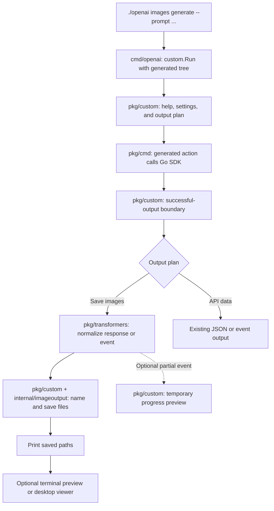
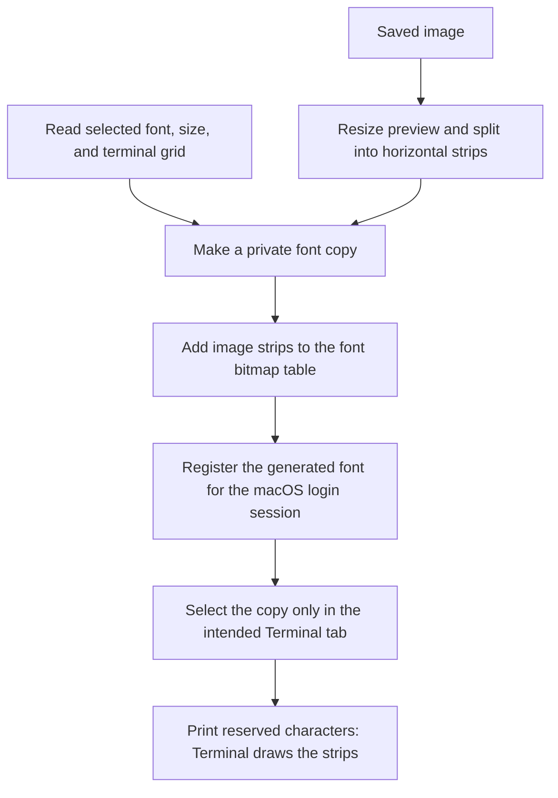

# Image feature: code map

Start with [the user guide](image-output.md) to try the commands. This page traces
the implementation for a code review.

## Where the code lives

```text
openai-cli/
├── cmd/openai/       One main.go: passes the generated tree to the custom runner
├── pkg/cmd/          Generated API commands, flags, and SDK calls
├── pkg/custom/       CLI behavior: help, command decoration, saving, and display
├── pkg/transformers/ Pure transformations of successful JSON responses/events
├── internal/        Readable output, file, font, preview, and preference helpers
├── tests/cli/       Process-level tests of the assembled CLI
├── docs/            Explains behavior and implementation
├── scripts/         Builds, tests, and checks generated-code customizations
├── api_reference/   API specification used by the local mock server
└── openai           Local executable produced by a build; not source code
```

`go build -o openai ./cmd/openai` compiles the Go source into the executable.
Editing source does not update an executable that was built earlier. The
`api_reference/` folder intentionally has its own Go module; keep it separate.

## How the layers connect

The generated command tree calls `custom.ConfigureCommand` after assembly.
That hook decorates the existing image command and registers local commands such
as `images preview`, `images inline`, `images models`, and `images options`.
`main.go` then passes the tree and arguments to `custom.Run`, which owns help,
completion, request setup, exit codes, and error presentation.

| Layer | What belongs here |
| --- | --- |
| `cmd/openai` | Bootstrap the program. It contains no image workflow or tests. |
| `pkg/cmd` | Generated commands and their existing custom-runtime adapter. The image feature does not hand-edit generated handlers or flag definitions. |
| `pkg/custom` | Decorate commands, choose defaults, prepare requests, validate local settings, save files, manage previews, and present output. |
| `pkg/transformers` | Transform one JSON response or stream event into a reusable data shape. Transformers respect cancellation and do not make requests, write files, render terminals, or advance streams. |
| `internal` | Implement focused helpers used by those layers. |

`pkg/custom` and `pkg/transformers` do not import `pkg/cmd`. The generated tree
is supplied to the custom layer, so regeneration keeps the extension point
without embedding the feature implementation in generated files.

## Follow one generation



The save branch is the default for generation, editing and variations, including
redirected output. Generation and editing also save streamed final images. Explicit data formats select the API-output branch;
[the user guide](image-output.md) explains those combinations. Local
`images preview FILE` starts at the preview branch and makes no API request.

The image wrapper prepares request options once, then delegates the request to
the generated action. The existing custom `FlagOptions` boundary consumes those
prepared options, so stdin and file references are not read a second time.
For edits and variations, `image_upload.go` checks scalar settings and adds defaults
before the shared multipart encoder takes ownership of upload readers. Upload
bytes remain streamed, and source files are left unchanged. Variations keep their
DALL-E 2 request contract; editing supports its own partial/completed stream events.
Successful output carries an operation identifier, output kind, and context.
The custom output boundary uses that information to select the image workflow.

The image transformer keeps ordinary responses in their existing `data` shape.
For known partial/completed stream events, it moves `b64_json` into a `data`
array while preserving other metadata. The custom layer owns iteration,
temporary previews, final-image saving, and cleanup. Unknown events keep their
original JSON. Explicit data formats, `--transform`, and `--raw-output` retain
their existing API-data behavior. `--format auto` and `--format text` keep
automatic saving when otherwise eligible. Errors have no successful-operation route.

Across the CLI, the custom output boundary selects readable text for the default,
`auto`, and `text` formats. Known text responses and stream events use pure
projections in `pkg/transformers/readable.go`; other shapes use the recursive
renderer in `internal/readable`. Text, nested fields, and list entries print
directly without an automatic pager. Explicit data modes retain full API values.
This changes the default for scripts: callers that parse JSON must add
`--format json`. See the [output guide](readable-output.md).

The `pkg/transformers` package is a code extension point. The existing
`--transform` flag remains the user's GJSON field-selection option.

| Follow this part | Start here |
| --- | --- |
| Bootstrap and CLI lifecycle | [cmd/openai/main.go](../cmd/openai/main.go), [pkg/custom/run.go](../pkg/custom/run.go) |
| Extension registration and image action wrapper | [command.go](../pkg/custom/command.go), [image_command.go](../pkg/custom/image_command.go) |
| Welcome page, setup help, and full-reference routing | [pkg/custom/help.go](../pkg/custom/help.go) |
| Short generation help and detailed setting guides | [image_help.go](../pkg/custom/image_help.go), [image_options.go](../pkg/custom/image_options.go) |
| Generated image API handler and SDK call | [pkg/cmd/image.go](../pkg/cmd/image.go) |
| Successful-output routing and presentation | [cmdutil.go](../pkg/custom/cmdutil.go), [output_transform.go](../pkg/custom/output_transform.go) |
| Readable response and stream presentation | [readable_output.go](../pkg/custom/readable_output.go), [pkg/transformers/readable.go](../pkg/transformers/readable.go), [internal/readable/](../internal/readable/) |
| Pure image response/event transformation | [pkg/transformers/image.go](../pkg/transformers/image.go), [output.go](../pkg/transformers/output.go) |
| Multipart edit/variation workflow and short help | [image_upload.go](../pkg/custom/image_upload.go) |
| Defaults, validation, save policy, and preview routing | [image_output.go](../pkg/custom/image_output.go), [image_settings_validation.go](../pkg/custom/image_settings_validation.go) |
| Names, downloads, collision handling, and saved files | [internal/imageoutput/](../internal/imageoutput/), especially [promptname.go](../internal/imageoutput/promptname.go) |
| Progress events, temporary previews, and final-image saving | [pkg/custom/image_stream.go](../pkg/custom/image_stream.go) |
| Readable error messages | [pkg/custom/image_errors.go](../pkg/custom/image_errors.go) |
| Known model IDs and bounded visibility checks | [pkg/custom/image_models.go](../pkg/custom/image_models.go), [internal/imagemodels/](../internal/imagemodels/) |
| Local preview command | [pkg/custom/image_preview.go](../pkg/custom/image_preview.go) |
| Native terminal protocols and text fallback | [internal/imagepreview/](../internal/imagepreview/) |
| Saved preview preference and external viewer | [internal/imageprefs/](../internal/imageprefs/), [internal/imageopen/](../internal/imageopen/) |

API handlers are generated by Castiron. Feature changes belong in the custom
layer or transformers, using the generated runtime boundary. Keep the generated
flag definitions and API-output path intact. See
[custom-code accounting](../scripts/castiron/CUSTOM_CODE.md).

## How Apple Terminal displays an image

The experimental Apple Terminal path uses a generated color font. Ordinary text
uses outlines copied from the user's selected font. Reserved private-use
characters draw image pixels from the generated font's bitmap table.



Each displayed row reserves several character cells. Its first character draws
a bitmap spanning the row; the remaining characters advance through the reserved
cells. This avoids visible seams between individual character tiles.

The original installed font files are never edited. The generated copy aims to
preserve text appearance and includes available companion faces; some metrics
and font tables are adjusted. The selected Inspector profile and font size are
kept. Registration is session-wide, while selection is guarded by the exact
Terminal tab and its settings.

Read the implementation in this order:

1. [image_inline_current.go](../pkg/custom/image_inline_current.go): enable the current tab.
2. [internal/imagefontmac/source.go](../internal/imagefontmac/source.go): read the selected font through CoreText.
3. [image_inline_preserved.go](../pkg/custom/image_inline_preserved.go): prepare and activate a preview, recheck settings, then print.
4. [internal/imagefont/preserve.go](../internal/imagefont/preserve.go) and [preserve_geometry.go](../internal/imagefont/preserve_geometry.go): build the font copy and its image strips.
5. [internal/imagegallery/](../internal/imagegallery/): retain image mappings and font variants so later images do not replace earlier ones.
6. [internal/imagefontmac/bridge.js](../internal/imagefontmac/bridge.js) and [profile.js](../internal/imagefontmac/profile.js): register fonts and apply the guarded tab override.

## Where the resulting files go

| Data | Location and lifetime |
| --- | --- |
| Finished images | `~/Downloads/gpt-images/` by default, or the chosen output directory; retained until the user removes them |
| Partial-image files | A temporary directory, removed when the stream handler exits |
| Apple Terminal preview data | The OS user-cache directory under `openai/image-terminal`; contains thumbnails and generated fonts until reset |
| Automatic-preview preference | The OS user-config directory under `openai/image-preferences.json` |

On macOS, the cache is under `~/Library/Caches/` and preferences are under
`~/Library/Application Support/`. Preview-cache cleanup does not delete finished
images. A rendered partial preview can remain embedded in that cache after its
temporary image file is removed. The 6,400-cell gallery limit does not cap total
cache bytes: font revisions and typography variants also occupy space.

## Verification and review boundaries

Unit tests sit beside their implementations in `*_test.go`. Helper tests cover
synthetic image data, file handling, rendering, fonts, and cache ownership.
Command tests in `pkg/custom` and process-level tests in `tests/cli` use local
HTTP servers for saving, errors, model checks, streaming, and help. Transformer
tests cover response/event data and cancellation independently of the terminal.
`tests/cli` is included by `go test ./...`; a directory named `__tests__` would
be skipped by Go's recursive package discovery. Terminal automation tests use
mocks; additional macOS tests read installed fonts through CoreText. These
checks do not prove visual correctness
in every terminal or font.

```sh
go test ./internal/imagefont ./internal/imagefontmac ./internal/imagegallery ./internal/imageoutput ./internal/imagepreview ./internal/imageopen ./internal/imageprefs ./internal/imagemodels
go test ./pkg/transformers ./pkg/custom ./tests/cli -run '^Test(Main|Help|Image[A-Z]|ImagesGenerate(Output|FriendlyStream)|ReportImagePreview)' -count=1
```

The existing generated API tests additionally need the repository's local mock
server; see [CONTRIBUTING.md](../CONTRIBUTING.md). Keep live API credentials and
user images out of fixtures and recordings.

Areas that still need review before shipping:

- Native visual behavior across terminal apps, fonts, spacing, resizing, and
  platforms. Cross-compilation does not establish Windows rendering support.
- Apple Terminal font compatibility, session lifetime, cache growth, and the
  local copying of installed font data. Unsupported settings can reject setup.
- Missing selected font variants: select the original text font before repair;
  repair cannot restore missing thumbnails or ownership metadata.
- Model discovery is a maintained list of exact IDs, not a complete account
  catalog. Metadata visibility does not guarantee generation permission.
- Editing and variations use the shared saving path. Synthetic multipart and
  streaming tests cover request and file behavior; native preview appearance
  still needs the same terminal testing as generation.
