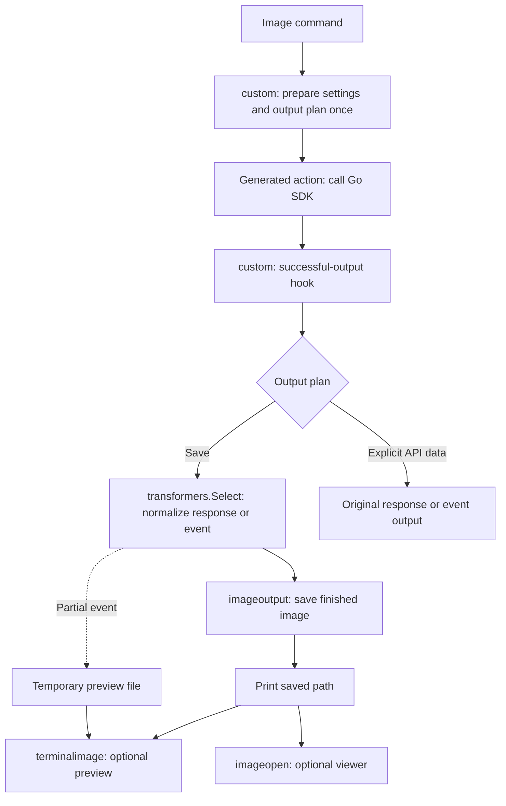
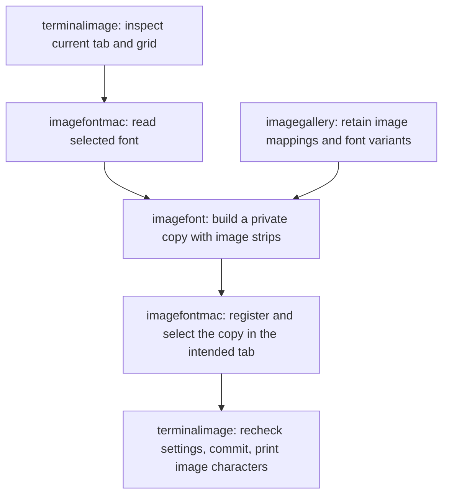

# Feature implementation and review map

This branch builds on [PR #223](https://github.com/openai/openai-cli/pull/223).
Its changes cover image workflows, local help, and readable output throughout
the CLI. The [image guide](image-output.md) and [readable output guide](readable-output.md)
describe user behavior; this page explains where to review its implementation.

## Start with the integration points

1. [cmd/openai/main.go](../cmd/openai/main.go) retains startup, completion,
   execution, error handling, and exit codes. The
   [output architecture](architecture/output-pipeline.md#responsibilities)
   explains each change to that lifecycle.
2. [pkg/custom/command.go](../pkg/custom/command.go) registers command extensions
   after the generated tree is assembled.
3. [pkg/custom/cmdutil.go](../pkg/custom/cmdutil.go) receives successful output
   from the generated handlers and chooses its presentation.
4. [pkg/transformers/output.go](../pkg/transformers/output.go) selects a response
   transformation through the existing `Select` hook.
5. Follow the relevant feature in the table below. Its library owns the detailed
   implementation; its custom files connect it to commands and their options.

The generated API commands and SDK calls remain in `pkg/cmd`. The custom layer
receives those commands rather than importing the generated package. Local
libraries do not import the custom runtime or command tree. Tests stay alongside
the behavior they exercise: library tests with libraries, command integration
tests with custom code, and executable tests with `cmd/openai`.

## Feature ownership

| User-facing feature | Command integration | Implementation owner |
| --- | --- | --- |
| Welcome guide, key setup instructions, brief help, full reference | [help.go](../pkg/custom/help.go) attaches feature help | [internal/clihelp](../internal/clihelp/) routes local help and renders onboarding; [image_help.go](../pkg/custom/image_help.go) and [image_options.go](../pkg/custom/image_options.go) own image-specific explanations |
| Default image model/settings and easy option names | [image_command.go](../pkg/custom/image_command.go), [image_output.go](../pkg/custom/image_output.go) | [image_settings_validation.go](../pkg/custom/image_settings_validation.go) validates settings against the selected workflow; generated actions still make API calls |
| Editing and variations from existing images | [image_upload.go](../pkg/custom/image_upload.go) decorates existing commands | Shared request and multipart helpers in `pkg/custom` stream uploads and preserve file ownership |
| Automatic saving, prompt-based names, collision protection, custom folder | [image_output.go](../pkg/custom/image_output.go) selects and reports the save plan | [internal/imageoutput](../internal/imageoutput/) owns filenames, decoding, writes, and cleanup |
| Progress previews and streamed final images | [image_stream.go](../pkg/custom/image_stream.go) coordinates events and temporary files | [pkg/transformers/image.go](../pkg/transformers/image.go) normalizes known events; saving and preview libraries handle their output |
| Exact image model IDs and visibility checks | [image_models.go](../pkg/custom/image_models.go) registers and presents the command | [internal/imagemodels](../internal/imagemodels/) maintains the catalog and performs bounded metadata checks |
| Local image preview, setup, repair, test, status, reset | [image_preview.go](../pkg/custom/image_preview.go), [image_inline.go](../pkg/custom/image_inline.go) | [internal/terminalimage](../internal/terminalimage/) owns terminal protocols, text fallback, setup offers, and Apple Terminal preview lifecycle |
| Preserve the selected Apple Terminal font and profile | Called by `internal/terminalimage` | [internal/imagefont](../internal/imagefont/) builds fonts; [internal/imagefontmac](../internal/imagefontmac/) reads and applies native font/tab settings; [internal/imagegallery](../internal/imagegallery/) retains image mappings and font variants |
| Preview on/off preference and external image viewer | [image_preferences.go](../pkg/custom/image_preferences.go) and preview/save coordinators | [internal/imageprefs](../internal/imageprefs/) persists the setting; [internal/imageopen](../internal/imageopen/) launches the platform viewer |
| Readable text, summaries, lists, and streamed text across the CLI | [readable_output.go](../pkg/custom/readable_output.go), [output_transform.go](../pkg/custom/output_transform.go) | [internal/readable](../internal/readable/) projects API values and renders text, details, summaries, and stream updates |
| Audio text, subtitles, and speech events | [readable_audio.go](../pkg/custom/readable_audio.go), [readable_speech.go](../pkg/custom/readable_speech.go) | Adapters preserve native responses at existing transport/output hooks and pass structured values to shared presentation; binary output retains its byte contract |
| Helpful errors and confirmations | [readable_errors.go](../pkg/custom/readable_errors.go), [image_errors.go](../pkg/custom/image_errors.go), [readable_success.go](../pkg/custom/readable_success.go) | Custom presenters use command metadata; `main.go` owns error output and exit codes; [stream_status.go](../pkg/transformers/stream_status.go) classifies failure events |
| Explicit JSON, raw output, field extraction, and explorer compatibility | [cmdutil.go](../pkg/custom/cmdutil.go), [output_transform.go](../pkg/custom/output_transform.go) | Original API values bypass default transformation and readable projection; existing format writers retain their behavior |

Command-specific policy stays next to command registration. It is not moved into
a generic library merely to reduce a file's diff. Implementation libraries have
concrete responsibilities and can be tested without assembling the whole CLI.

## Follow one image request



The save branch is the default for generation, editing, and variations, including
redirected output. Generation and editing also save streamed final images. The
request wrapper delegates to the generated action; its `FlagOptions` call
consumes prepared options without rereading stdin or reopening files. Upload
readers remain streamed and source files remain unchanged.

Known partial and completed events are normalized into the ordinary image
response's `data` shape while retaining metadata. The coordinator owns stream
iteration and temporary preview lifetime. Unknown events retain their original
JSON. A preview error leaves saved images available. Local `images preview FILE`
starts with the preview library and makes no API call.

Across other commands, the same output boundary uses `internal/readable.Project`
and its writers. The original JSON and readable `View` stay separate. The custom
iterator prepares each item once, while `StreamWriter` handles display and
completion deduplication. See the [output architecture](architecture/output-pipeline.md)
for cancellation, explicit formats, and failure handling.

## How Apple Terminal displays an image

The experimental Apple Terminal path uses a generated color font. Ordinary text
uses outlines copied from the selected font; reserved private-use characters
draw image pixels from its bitmap table.



Each displayed row reserves several character cells. Its first character draws a
bitmap spanning the row; the remaining characters advance through those cells.
This avoids seams between individual character tiles. Original installed font
files are not edited. The copy includes available companion faces and aims to
preserve ordinary text; some metrics and font tables are adjusted. The selected
Inspector profile and font size are kept. Registration is session-wide, while
font selection is guarded by the exact tab and its settings.

Review the four responsibilities in this order:

1. `internal/terminalimage`: `Preview`, `Prepare`, `Setup`, `Test`, `Status`, and
   `Reset` coordinate rendering and the local font lifecycle.
2. `internal/imagefontmac`: CoreText font inspection and guarded Terminal automation.
3. `internal/imagefont`: outline preservation, geometry, and bitmap construction.
4. `internal/imagegallery`: stable character mappings, font variants, locking,
   persistence, and recovery.

## Files produced by the feature

| Data | Location and lifetime |
| --- | --- |
| Finished images | `~/Downloads/gpt-images/` by default, or the chosen output directory; retained until removed by the user |
| Partial-image files | Private temporary directory, removed when the stream handler exits |
| Apple Terminal preview cache | OS user-cache directory under `openai/image-terminal`; thumbnails and generated fonts remain until reset |
| Automatic-preview preference | OS user-config directory under `openai/image-preferences.json` |

On macOS, cache and preferences live under `~/Library/Caches/` and
`~/Library/Application Support/`. Preview reset does not delete finished images.
A partial preview can remain embedded in the font cache after its temporary
image file is removed. The 6,400-cell gallery limit does not cap cache bytes:
font revisions and typography variants also consume space.

The repository-root `openai` file is a locally built executable, not source.
Run `go build -o openai ./cmd/openai` after changing Go code. `api_reference/`
intentionally has its own Go module and remains separate.

## Verification

Library tests use synthetic images, owned temporary files, and mocked native
automation. Command and executable tests use local HTTP servers for defaults,
uploads, saving, errors, model checks, streaming, and help. Entrypoint tests call
the actual `main()` in a fresh process. macOS-specific tests additionally inspect
installed fonts through CoreText.

```sh
go test ./internal/clihelp ./internal/readable ./internal/terminalimage
go test ./internal/imagefont ./internal/imagefontmac ./internal/imagegallery ./internal/imageoutput ./internal/imageopen ./internal/imageprefs ./internal/imagemodels
go test ./pkg/transformers ./pkg/custom ./cmd/openai ./tests/architecture
```

Generated API integration tests also require the local mock server; see
[CONTRIBUTING.md](../CONTRIBUTING.md). Generated ownership and the existing
[custom-code budget](../scripts/castiron/CUSTOM_CODE.md) remain unchanged.

Native visual behavior still needs testing across terminal apps, fonts, spacing,
resizing, and platforms. Cross-compilation does not prove Windows rendering
support. Apple Terminal font compatibility, cache growth, restoration, and
font-data copying need their own review. Model discovery is a maintained list
of exact IDs; metadata visibility does not guarantee generation permission.
