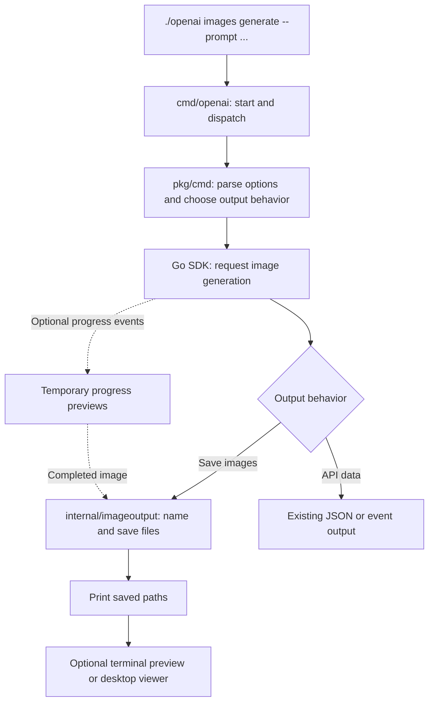
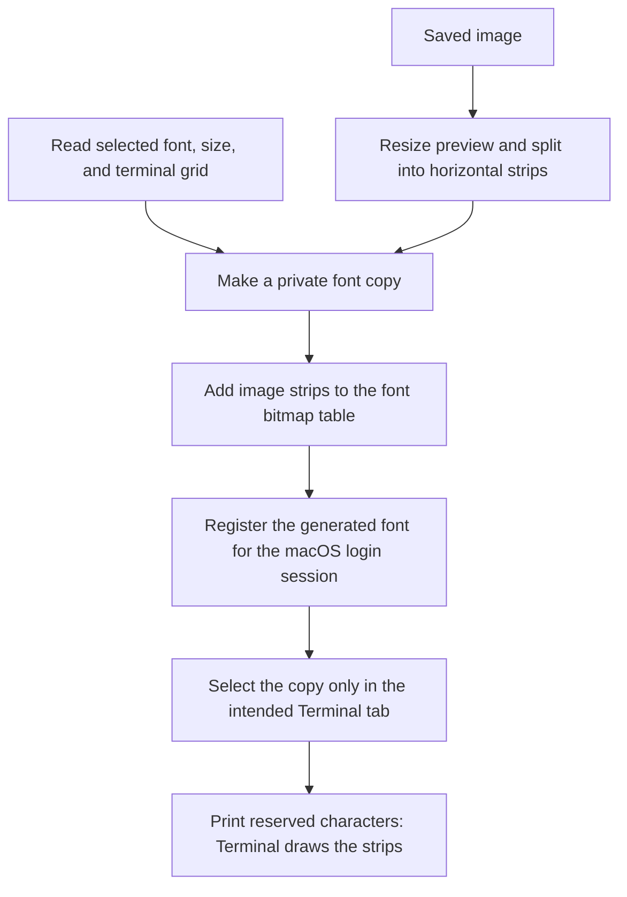

# Image feature: code map

Start with [the user guide](image-output.md) to try the commands. This page traces
the implementation for a code review.

## Where the code lives

```text
openai-cli/
├── cmd/openai/       Starts the program and routes help and commands
├── pkg/cmd/          Connects image commands, API requests, saving, and previews
├── internal/        Implements the file, font, preview, and preference helpers
├── docs/            Explains behavior and implementation
├── scripts/         Builds, tests, and checks generated-code customizations
├── api_reference/   API specification used by the local mock server
└── openai           Local executable produced by a build; not source code
```

`go build -o openai ./cmd/openai` compiles the Go source into the executable.
Editing source does not update an executable that was built earlier. The
`api_reference/` folder intentionally has its own Go module; keep it separate.

## Follow one generation



The save branch is the default for ordinary interactive generation. Explicit
formats, redirected output, and saving flags determine which branch runs;
[the user guide](image-output.md) explains those combinations. Local
`images preview FILE` starts at the preview branch and makes no API request.

| Follow this part | Start here |
| --- | --- |
| Program entry and command dispatch | [cmd/openai/main.go](../cmd/openai/main.go) |
| Welcome page, setup help, and full-reference routing | [pkg/cmd/help.go](../pkg/cmd/help.go) |
| Short generation help and detailed setting guides | [image_help.go](../pkg/cmd/image_help.go), [image_options.go](../pkg/cmd/image_options.go) |
| Image API handler and SDK call | [pkg/cmd/image.go](../pkg/cmd/image.go) |
| Defaults, validation, save policy, and preview routing | [image_output.go](../pkg/cmd/image_output.go), [image_settings_validation.go](../pkg/cmd/image_settings_validation.go) |
| Names, downloads, collision handling, and saved files | [internal/imageoutput/](../internal/imageoutput/), especially [promptname.go](../internal/imageoutput/promptname.go) |
| Progress events, temporary previews, and final-image saving | [pkg/cmd/image_stream.go](../pkg/cmd/image_stream.go) |
| Readable error messages | [pkg/cmd/image_errors.go](../pkg/cmd/image_errors.go) |
| Known model IDs and bounded visibility checks | [pkg/cmd/image_models.go](../pkg/cmd/image_models.go), [internal/imagemodels/](../internal/imagemodels/) |
| Local preview command | [pkg/cmd/image_preview.go](../pkg/cmd/image_preview.go) |
| Native terminal protocols and text fallback | [internal/imagepreview/](../internal/imagepreview/) |
| Saved preview preference and external viewer | [internal/imageprefs/](../internal/imageprefs/), [internal/imageopen/](../internal/imageopen/) |

Most API handlers are generated by Castiron. The image handler has small hooks
into handwritten helpers; keep the generated flag definitions and API-output
path intact. See [custom-code accounting](../scripts/castiron/CUSTOM_CODE.md).

## How Apple Terminal displays an image

The experimental Apple Terminal path uses a generated color font. Ordinary text
uses outlines copied from the user's selected font. Reserved private-use
characters draw image pixels from the generated font's bitmap table.



Each displayed row reserves several character cells. Its first character draws
a bitmap spanning the row; the remaining characters advance through the reserved
cells. This avoids visible seams between individual character tiles.

The original installed font files are never edited. The generated copy aims to
preserve text appearance and includes available companion faces; some metrics
and font tables are adjusted. The selected Inspector profile and font size are
kept. Registration is session-wide, while selection is guarded by the exact
Terminal tab and its settings.

Read the implementation in this order:

1. [image_inline_current.go](../pkg/cmd/image_inline_current.go): enable the current tab.
2. [internal/imagefontmac/source.go](../internal/imagefontmac/source.go): read the selected font through CoreText.
3. [image_inline_preserved.go](../pkg/cmd/image_inline_preserved.go): prepare and activate a preview, recheck settings, then print.
4. [internal/imagefont/preserve.go](../internal/imagefont/preserve.go) and [preserve_geometry.go](../internal/imagefont/preserve_geometry.go): build the font copy and its image strips.
5. [internal/imagegallery/](../internal/imagegallery/): retain image mappings and font variants so later images do not replace earlier ones.
6. [internal/imagefontmac/bridge.js](../internal/imagefontmac/bridge.js) and [profile.js](../internal/imagefontmac/profile.js): register fonts and apply the guarded tab override.

## Where the resulting files go

| Data | Location and lifetime |
| --- | --- |
| Finished images | `~/Downloads/gpt-images/` by default, or the chosen output directory; retained until the user removes them |
| Partial-image files | A temporary directory, removed when the stream handler exits |
| Apple Terminal preview data | The OS user-cache directory under `openai/image-terminal`; contains thumbnails and generated fonts until reset |
| Automatic-preview preference | The OS user-config directory under `openai/image-preferences.json` |

On macOS, the cache is under `~/Library/Caches/` and preferences are under
`~/Library/Application Support/`. Preview-cache cleanup does not delete finished
images. A rendered partial preview can remain embedded in that cache after its
temporary image file is removed. The 6,400-cell gallery limit does not cap total
cache bytes: font revisions and typography variants also occupy space.

## Verification and review boundaries

Tests sit beside their implementations in `*_test.go`. Helper tests cover
synthetic image data, file handling, rendering, fonts, and cache ownership.
Command tests use local HTTP servers for saving, errors, model checks, streaming,
and help. Terminal automation tests use mocks; additional macOS tests read
installed fonts through CoreText. These checks do not prove visual correctness
in every terminal or font.

```sh
go test ./internal/imagefont ./internal/imagefontmac ./internal/imagegallery ./internal/imageoutput ./internal/imagepreview ./internal/imageopen ./internal/imageprefs ./internal/imagemodels
go test ./cmd/openai ./pkg/cmd -run '^Test(Main|Help|Image[A-Z]|ImagesGenerate(Output|FriendlyStream)|ReportImagePreview)' -count=1
```

The existing generated API tests additionally need the repository's local mock
server; see [CONTRIBUTING.md](../CONTRIBUTING.md). Keep live API credentials and
user images out of fixtures and recordings.

Areas that still need review before shipping:

- Native visual behavior across terminal apps, fonts, spacing, resizing, and
  platforms. Cross-compilation does not establish Windows rendering support.
- Apple Terminal font compatibility, session lifetime, cache growth, and the
  local copying of installed font data. Unsupported settings can reject setup.
- Missing selected font variants: select the original text font before repair;
  repair cannot restore missing thumbnails or ownership metadata.
- Model discovery is a maintained list of exact IDs, not a complete account
  catalog. Metadata visibility does not guarantee generation permission.
- Automatic downloads and friendly final output currently apply to generation;
  editing and variations retain their existing API-output behavior.
